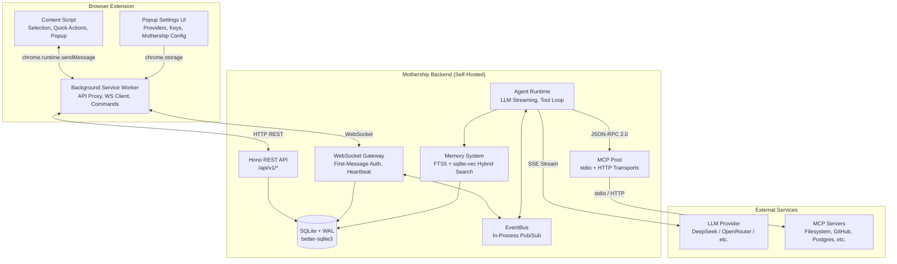
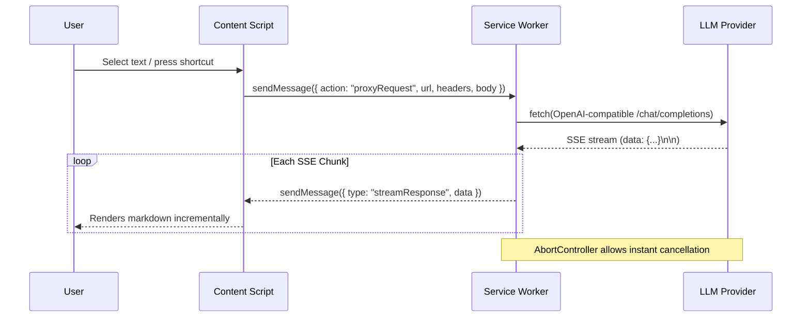
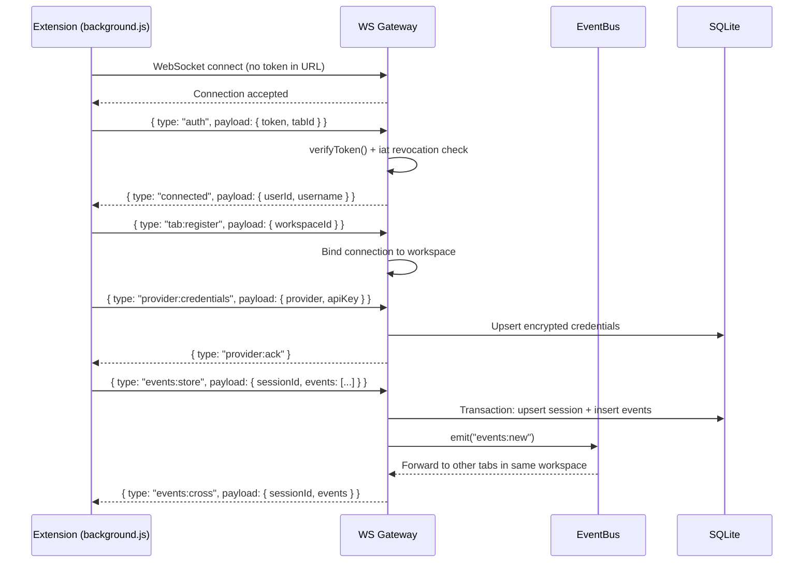
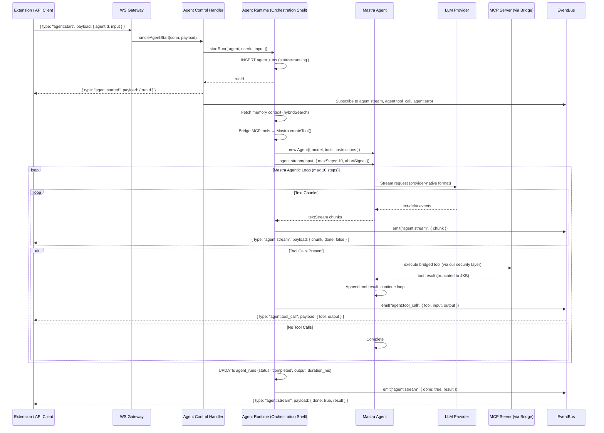
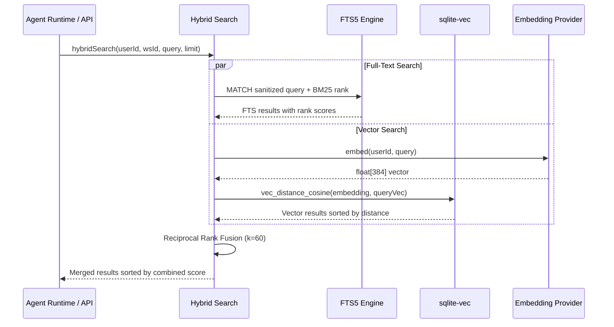

# DeepSeekAI - Smart Web Assistant + Regent Agent Orchestrator

<div align="center">


[](https://chromewebstore.google.com/detail/bjjobdlpgglckcmhgmmecijpfobmcpap)
[](LICENSE)
[](https://github.com/DeepLifeStudio/DeepSeekAI/stargazers)

[English](README.md) | [简体中文](README.zh-CN.md)

</div>

## Introduction

DeepSeekAI is an open-source browser extension that lets you summon a private AI co-pilot anywhere on the web. Highlight text, tap a quick action, or press a shortcut to open a floating chat workspace that streams answers, shows reasoning traces, and remembers your preferred layout.

**Regent Mothership** is the optional self-hosted backend that adds cross-session memory, multi-user workspaces, autonomous AI agents with MCP tool access, and real-time collaboration via WebSocket.

> **Note**: This extension is a community project and is not affiliated with DeepSeek. Keys, custom endpoints, and preferences are stored only in `chrome.storage.sync` on your device. The Mothership backend is entirely self-hosted — your data never leaves your infrastructure.

### Supported API Providers
- [DeepSeek](https://deepseek.com) (official endpoint)
- [ByteDance Volcengine](https://www.volcengine.com/experience/ark)
- [SiliconFlow](https://cloud.siliconflow.cn)
- [OpenRouter](https://openrouter.ai/models)
- [AiHubMix](https://aihubmix.com)
- [Tencent Cloud](https://cloud.tencent.com/document/product/1772/115969)
- [IFlytek Star](https://training.xfyun.cn/modelService)
- [Baidu Cloud](https://console.bce.baidu.com/qianfan/modelcenter/model/buildIn/list)
- [Aliyun](https://bailian.console.aliyun.com/#/model-market)
- Any self-hosted/custom provider exposing an OpenAI-compatible `/chat/completions` endpoint

---

## Architecture Overview



### Component Responsibilities

| Component | Role |
|---|---|
| **Content Script** | Selection tracking, quick-action bubble, floating workspace, markdown rendering, theme |
| **Background Worker** | Network proxy (fetch + AbortController), WS connection manager, keyboard commands |
| **Popup UI** | Provider/model config, API keys, Mothership connection, language, system prompt |
| **REST API** | Auth (register/login/revoke), workspaces, sessions, events, memory, agents, MCP, invites |
| **WS Gateway** | Real-time bidirectional messaging with first-message auth, heartbeat, event broadcasting |
| **Agent Runtime** | Mastra-powered agentic loop (max 10 steps): LLM stream → tool calls → MCP execution → repeat |
| **MCP Pool** | Manages MCP server connections (stdio subprocess or HTTP), command allowlist, SSRF protection |
| **Memory System** | Hybrid search: FTS5 full-text + sqlite-vec cosine similarity, merged via Reciprocal Rank Fusion |
| **EventBus** | In-process EventEmitter routing agent streams, tool calls, events, and notifications to WS connections |

---

## Sequence Diagrams

### Extension Chat Flow (Standalone, No Mothership)



### Mothership Connection & Event Flow



### Agent Execution Flow (Mastra-Powered)



### Memory Hybrid Search (RAG)



---

## Feature Overview

### Inline Assistants
- Rich quick-action bubble beside any text selection: Chat, Copy, Translate (19 languages), Explain, Summarize, Email, Analyze.
- SelectionPreservationManager keeps the DOM range alive so the bubble never steals your highlight.
- Right-click context menu and toolbar popup share the same session logic.

### Floating Workspace
- Drag + resize via `interactjs` with snap animations and persistent minimize icon position.
- Toggle "Remember window size" and "Pin window" for cross-site consistency.
- Auto-expanding textarea, send/abort controls, copy + regenerate per answer, collapsible reasoning blocks.
- Auto-scroll follows the stream until manual scroll, with momentum + cooldown logic.

### Regent Agents (Mothership)
- **Custom Agents**: Define agents with name, system prompt, and MCP server bindings.
- **Agentic Tool Loop**: Up to 10 rounds of LLM reasoning + MCP tool execution per run.
- **Memory-Augmented (RAG)**: Agents automatically fetch relevant context from past sessions via hybrid FTS5 + vector search.
- **Real-Time Streaming**: Response chunks, tool calls, and errors stream to the UI via WebSocket.
- **MCP Integration**: Connect external tools (filesystem, GitHub, Postgres, custom servers) via Model Context Protocol (stdio or HTTP transport).
- **RBAC**: Owner > Admin > Member > Viewer role hierarchy per workspace.

### Provider & Model Controls
- Popup UI manages API keys per provider, language preference, selection bubble toggle.
- Add/rename/delete custom providers with base URL, default model, and placeholder links.
- Global custom system prompt, overridable per quick action.

### Privacy & Security
- Extension: API keys stored only in `chrome.storage.sync`. No telemetry. DOMPurify sanitizes all rendered HTML.
- Mothership: JWT auth with token revocation, AES-256-GCM encryption for API keys at rest, RBAC, rate limiting, SSRF protection, MCP command allowlist, non-root Docker container.

---

## Project Layout

```
.
├── src/                              # Browser extension source
│   ├── manifest.json                 # MV3 metadata & permissions
│   ├── background.js                 # Service worker: API proxy, WS client, commands
│   ├── content/                      # Content script layer
│   │   ├── content.js                # Main orchestrator
│   │   ├── components/               # SelectionManager, PopupManager, InputContainer, etc.
│   │   ├── services/                 # apiService (background proxy)
│   │   ├── utils/                    # markdownRenderer, themeManager, scrollManager, etc.
│   │   ├── handlers/                 # MouseHandler
│   │   ├── regent/                   # RegentOrchestrator, Sidecar, Detector, Sidebar, AI Service
│   │   └── styles/                   # Extension CSS
│   ├── popup/                        # Settings UI (managers, i18n, HTML)
│   └── Instructions/                 # Onboarding guide
│
├── mothership/                       # Self-hosted backend
│   ├── src/
│   │   ├── index.ts                  # Server entry: Hono + WS + graceful shutdown
│   │   ├── config.ts                 # Env var parsing (PORT, JWT_SECRET, DB_PATH, LOG_LEVEL)
│   │   ├── api/
│   │   │   ├── index.ts              # Route mounting, CORS config
│   │   │   ├── middleware/            # auth.ts (JWT), workspace.ts (RBAC)
│   │   │   └── routes/               # auth, workspaces, sessions, events, memory,
│   │   │                             # agents, mcp, invites, notifications
│   │   ├── ws/
│   │   │   ├── gateway.ts            # WS upgrade, first-message auth, message dispatch
│   │   │   ├── registry.ts           # Connection registry, workspace broadcast
│   │   │   └── handlers/             # tabRegister, eventsStore, contextQuery, agentControl
│   │   ├── agents/
│   │   │   ├── manager.ts            # Agent CRUD (create, list, get, delete)
│   │   │   ├── runtime.ts            # Orchestration shell + Mastra Agent execution
│   │   │   ├── mcpBridge.ts          # MCP tools → Mastra createTool() bridge
│   │   │   └── modelResolver.ts      # DB credentials → Mastra model config
│   │   ├── mcp/
│   │   │   ├── client.ts             # JSON-RPC 2.0 MCP client (stdio + HTTP)
│   │   │   └── pool.ts              # Connection pool, workspace tool aggregation
│   │   ├── memory/
│   │   │   ├── embeddings.ts         # Vector embedding + provider credential management
│   │   │   ├── search.ts             # Hybrid search: FTS5 + sqlite-vec + RRF merge
│   │   │   └── retention.ts          # Data retention scheduler
│   │   ├── events/
│   │   │   └── bus.ts                # In-process EventEmitter pub/sub
│   │   ├── queue/
│   │   │   └── laneQueue.ts          # Per-session serial execution queue
│   │   ├── db/
│   │   │   ├── index.ts              # SQLite init, atomic migrations, WAL mode
│   │   │   ├── schema.ts             # TypeScript type definitions
│   │   │   └── migrations/           # 001_foundation → 004_multiuser
│   │   └── utils/                    # crypto, id, logger, rateLimit
│   ├── Dockerfile                    # Multi-stage Node 22, non-root user
│   ├── docker-compose.yml            # mothership + Caddy reverse proxy
│   ├── Caddyfile                     # Auto-HTTPS reverse proxy config
│   └── .env.example                  # Environment variable template
│
├── webpack.config.js                 # Extension bundler config
├── PRIVACY.html                      # Privacy policy
└── README.md
```

---

## Installation & Setup

### 1. Extension (Chrome / Edge)

**From the store (recommended):**
- **Chrome**: [Chrome Web Store](https://chromewebstore.google.com/detail/bjjobdlpgglckcmhgmmecijpfobmcpap)
- **Edge**: Enable "Allow extensions from other stores" then install via Chrome Web Store.

**Manual / development build:**
```bash
# Requirements: Node.js 18+, pnpm (or npm)
pnpm install
pnpm run build          # outputs to dist/
```

1. Open `chrome://extensions` → enable **Developer mode** → **Load unpacked** → select `dist/`.
2. Click the extension icon → configure your API provider and key.
3. Highlight text or press `Ctrl+Shift+Y` to start chatting.

### 2. Mothership Backend (Optional)

The Mothership enables cross-session memory, agents, workspaces, and real-time sync. The extension works fully standalone without it.

#### Option A: Docker (Recommended for Production)

```bash
cd mothership

# 1. Create your environment file
cp .env.example .env
# Edit .env — set JWT_SECRET to a long random string:
#   JWT_SECRET=$(openssl rand -hex 32)

# 2. Start the stack (mothership + Caddy reverse proxy)
docker compose up -d

# 3. Verify it's running
curl http://localhost:3001/api/v1/health
# → {"status":"ok","ts":...}
```

**Environment variables:**

| Variable | Default | Description |
|---|---|---|
| `JWT_SECRET` | **(required)** | Secret for signing JWT tokens. Use `openssl rand -hex 32` |
| `PORT` | `3001` | HTTP server port |
| `DB_PATH` | `./data/mothership.db` | SQLite database file path |
| `LOG_LEVEL` | `info` | Pino log level: `debug`, `info`, `warn`, `error` |
| `EXTENSION_ID` | *(optional)* | Pin CORS to a specific Chrome extension ID |
| `ALLOWED_ORIGINS` | *(optional)* | Comma-separated allowed CORS origins |

#### Option B: Local Development (No Docker)

```bash
cd mothership

# 1. Install dependencies
npm install

# 2. Run in dev mode (auto-reload on file changes)
npm run dev
# → Mothership listening on http://localhost:3001
# → [WARN] No JWT_SECRET set — using random ephemeral secret

# Or build and run production:
npm run build
JWT_SECRET=your-secret-here npm start
```

**TypeScript commands:**
```bash
npm run typecheck   # Type validation only (no emit)
npm run build       # Compile TypeScript → dist/
npm start           # Run compiled dist/index.js
npm run dev         # Watch mode via tsx
```

### 3. Connect Extension to Mothership

Once the backend is running:

1. **Register a user** (first-time only):
   ```bash
   curl -X POST http://localhost:3001/api/v1/auth/register \
     -H 'Content-Type: application/json' \
     -d '{"username":"yourname","password":"your-password-here"}'
   # → {"id":"...","username":"yourname","token":"eyJ...","workspaceId":"..."}
   ```

2. **Or generate an API token** (if already registered):
   ```bash
   curl -X POST http://localhost:3001/api/v1/auth/token/generate \
     -H 'Content-Type: application/json' \
     -d '{"username":"yourname","password":"your-password-here"}'
   # → {"token":"eyJ...","expiresIn":"30d"}
   ```

3. **Configure the extension:**
   - Click the extension icon → scroll to **Mothership** section.
   - **URL**: `http://localhost:3001` (or your public domain).
   - **Token**: Paste the JWT token from step 1 or 2.
   - Click **Connect**. The status dot turns green.

4. **What happens on connect:**
   - The extension opens a WebSocket to `ws://localhost:3001/ws`.
   - Authenticates via first-message auth (token never in URL).
   - Registers with the workspace and forwards provider credentials.
   - Session events stream to the backend for memory storage.
   - Cross-tab events sync in real-time.

---

## Agent System

Agents are custom AI assistants that run server-side with access to MCP tools and workspace memory.

### Agent Runtime (Powered by Mastra)

The agent runtime uses **[Mastra](https://mastra.ai)** (`@mastra/core`) as the inner execution engine, wrapped in our orchestration shell for DB persistence, bus events, safety limits, and MCP security:

```
┌─ Orchestration Shell (our code) ──────────────────────┐
│  startRun() → DB record, AbortController               │
│  cancelRun() → abort, update DB                         │
│  finishRun() → write output/status/duration to DB       │
│                                                          │
│  ┌─ Mastra Agent (inner engine) ──────────────────────┐ │
│  │  Agent({ model, tools, instructions })              │ │
│  │  .stream(input, { maxSteps, abortSignal })          │ │
│  │  textStream → bus.emit('agent:stream')              │ │
│  └─────────────────────────────────────────────────────┘ │
│                                                          │
│  ┌─ MCP Security Layer (unchanged) ───────────────────┐ │
│  │  Command allowlist, SSRF protection, path traversal │ │
│  │  → Bridged to Mastra tools via createTool()         │ │
│  └─────────────────────────────────────────────────────┘ │
└──────────────────────────────────────────────────────────┘
```

- **Mastra handles**: LLM streaming, SSE parsing, tool call assembly, provider abstraction (800+ models / 47 providers), thinking/reasoning support.
- **We handle**: DB persistence, EventBus → WebSocket streaming, MCP security (command allowlist, SSRF, path traversal), safety limits (output caps, tool result truncation), run lifecycle tracking.
- **MCP Bridge**: Our `mcpBridge.ts` wraps MCP tools as Mastra `createTool()` instances. The MCP security layer (`mcp/client.ts`) remains unchanged.
- **Model Resolver**: `modelResolver.ts` maps encrypted DB credentials to Mastra `OpenAICompatibleConfig` objects, supporting DeepSeek, OpenRouter, SiliconFlow, OpenAI, and any custom endpoint.
- **Memory-augmented context (RAG)**: Before each run, hybrid search (FTS5 + vector cosine + RRF) injects relevant past context into the agent's instructions.

### Runtime Limits

| Limit | Value |
|---|---|
| Max tool rounds | 10 |
| Max output size | 256 KB |
| Max tool result size | 4 KB |
| Per-round timeout | 2 min |
| Agent runs rate limit | 5/min per user |

### API Endpoints

| Method | Endpoint | Auth | Description |
|---|---|---|---|
| `GET` | `/workspaces/:wsId/agents` | viewer+ | List agents |
| `POST` | `/workspaces/:wsId/agents` | admin+ | Create agent |
| `DELETE` | `/workspaces/:wsId/agents/:id` | admin+ | Delete agent |
| `POST` | `/workspaces/:wsId/agents/:id/run` | member+ | Start a run |
| `GET` | `/workspaces/:wsId/agents/:id/runs` | viewer+ | List runs |
| `GET` | `/workspaces/:wsId/agents/:id/runs/:rid` | viewer+ | Get run details |
| `POST` | `/workspaces/:wsId/agents/:id/runs/:rid/cancel` | member+ | Cancel a run |

### WebSocket Messages

**Client → Server:**
```json
{ "type": "agent:start", "payload": { "agentId": "...", "input": "Research X", "sessionId": "..." } }
{ "type": "agent:stop",  "payload": { "runId": "..." } }
```

**Server → Client:**
```json
{ "type": "agent:started",   "payload": { "runId": "...", "agentId": "..." } }
{ "type": "agent:stream",    "payload": { "runId": "...", "chunk": "text", "done": false } }
{ "type": "agent:tool_call", "payload": { "runId": "...", "tool": "name", "input": {}, "output": "..." } }
{ "type": "agent:stream",    "payload": { "runId": "...", "chunk": "", "done": true, "result": "..." } }
{ "type": "agent:error",     "payload": { "runId": "...", "error": "message" } }
```

### MCP Server Setup

Connect external tools via Model Context Protocol:

```bash
# Example: connect a filesystem MCP server
curl -X POST http://localhost:3001/api/v1/workspaces/WS_ID/mcp \
  -H 'Authorization: Bearer TOKEN' \
  -H 'Content-Type: application/json' \
  -d '{
    "name": "filesystem",
    "transport": "stdio",
    "command": "npx",
    "args": ["-y", "@modelcontextprotocol/server-filesystem", "/path/to/dir"]
  }'
```

**Allowed commands** (security allowlist): `npx`, `node`, `python`, `python3`, `uvx`, `docker`, and `mcp-server-*` prefixed binaries. Absolute paths, dangerous interpreter flags (`-e`, `--eval`, `-c`), and private network URLs are blocked.

---

## Database Schema

Four migrations build the schema incrementally:

| Migration | Tables |
|---|---|
| `001_foundation` | `users`, `sessions`, `events` |
| `002_memory_fts` | `memory_entries` (with embedding blob), `memory_fts` (FTS5 virtual table) |
| `003_agents_mcp` | `agents`, `agent_runs`, `mcp_servers` |
| `004_multiuser` | `workspaces`, `workspace_members`, `invites`, `notifications`, provider credentials on `users` |

SQLite runs in WAL mode with `busy_timeout=5000` and `foreign_keys=ON`. The `sqlite-vec` extension enables cosine similarity search on embedding vectors.

---

## Shortcuts & Quick Actions
- **Quick actions:** Chat, Copy, Translate (19 languages), Explain, Summarize, Email, Analyze.
- **Keyboard shortcuts:**
  - `Ctrl/Cmd + Shift + Y` → Toggle chat (new session)
  - `Ctrl/Cmd + Shift + U` → Show/hide chat (preserve session)
- **Context menu:** Right-click → "DeepSeek AI" to chat with selected text.
- Rebind via `chrome://extensions/shortcuts`.

## Contributing

Contributions are welcome — bug reports, documentation fixes, and feature proposals all help.

1. Fork the repo and create a branch (`git checkout -b feature/my-update`).
2. Install deps + build once (`pnpm install && pnpm run build`).
3. For Mothership changes: `cd mothership && npm install && npm run typecheck`.
4. Submit a Pull Request describing the change and verification notes.

## License

This project is licensed under the MIT License - see [LICENSE](LICENSE) for details.

## Contact

- Issues: [GitHub Issues](https://github.com/DeepLifeStudio/DeepSeekAI/issues)
- Email: [1024jianghu@gmail.com](mailto:1024jianghu@gmail.com)
- Twitter/X: [@DeepLifeStudio](https://x.com/DeepLifeStudio)

<div align="center">
<h3>If this project helps you, please consider giving it a star</h3>
</div>
